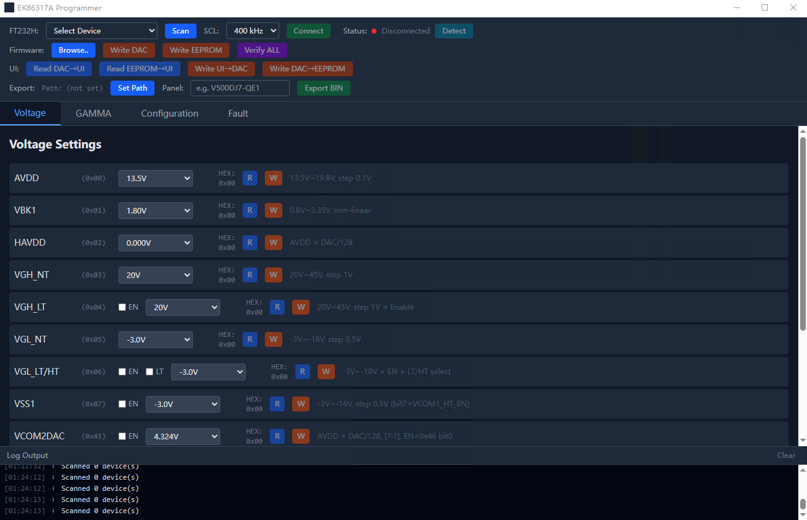

# EK86317A Programmer

这是一个为 EK86317A 开发的桌面调试工具。通过 FT232H 走 I2C 协议，实现对 PMU / VCOM 相关寄存器的读写、校验以及 EEPROM 烧录。

做这个工具的初衷是傻逼 Fitpower 在 2026 年用一个 8051 单片机和一个脑子抽了有病、没 log、逻辑还恶心人的上位机，关键这傻逼上位机还写 key 去算时长，是不是有病？

另外这是 Vibe Coding 产物。虽然让 Opus 4.6 写 plan，Sonnet / kimi 填代码，gpt-5.4-high 审核，强制要求写明代码注释，但不建议进行古法编译去修改代码。

## UI 预览



## 技术栈

- **前端**: React 18 + TypeScript + Vite
- **桌面**: Tauri 2
- **后端**: Rust
- **UI**: Tailwind CSS 4

## 目录结构

```text
.
├── src/                # 前端代码
│   ├── components/     # UI 组件
│   ├── hooks/          # 设备/寄存器状态逻辑
│   └── lib/            # 寄存器映射与 Tauri 命令封装
├── src-tauri/          # Rust 后端
│   ├── src/commands/   # Tauri API 路由
│   ├── src/ek86317a/   # 协议实现、寄存器定义、固件解析
│   └── src/ft232h/     # I2C 抽象层、FT232H 驱动实现
├── package.json
└── vite.config.ts
```

## 开发环境

- Node.js: 18+
- Rust: Stable
- Tauri 2 依赖: 参考 Tauri 官方文档配置环境
- FTDI 驱动: 已加入静态编译 dll

## 开始编译

安装依赖：

```bash
npm install
```

硬件和界面调试：

```bash
npm run tauri dev -- --features ft232h
```

注：Debug 构建下如果没有检测到 FT232H，会自动生成 `Mock FT232H (development)` 设备。

## 编译打包

由于涉及原生驱动绑定 `libftd2xx` 和系统 WebView，不推荐在本地环境交叉编译。

编译命令：

```bash
cargo tauri build --features ft232h
```

如果在 Linux 环境下编译，需要先安装这些依赖：

```bash
sudo apt install libwebkit2gtk-4.1-dev libxdo-dev libssl-dev libayatana-appindicator3-dev librsvg2-dev
```

## 使用方法

- **Scan & Connect**: 点击 `Scan`，扫到 FT232H 后连接
- **Detect**: 确认 I2C 链路上 PMIC 芯片是否正常在线
- **Read DAC / Read EEPROM**: 将 DAC / EEPROM 数据同步到 UI
- 在 UI 上修改相对应参数
- **Write EEPROM**: 烧录到芯片，参数永久保存在 PMU
- **Browse**: 导入 `.bin` 固件

## 避坑指南

- 频繁烧写会损耗寿命，建议先通过 `Write DAC` 确认参数没问题，再点 `Write EEPROM`
- Release 构建默认不会暴露 Mock 设备，必须确保 FTDI 驱动环境正常
- 为了版本管理，`Export BIN` 对文件名的自定义程度仅允许用户修改 panel name，生成的 bin 文件以 `PMU_PANELNAME_时间戳` 格式输出

## 未来规划

- 添加对 LP6281 和 iML8947 的支持
- 添加更多 IIC 调试工具，例如 ch347f。不过具体还得看看其他工具对 ft232h 以外工具的支持情况

## License

MIT License
